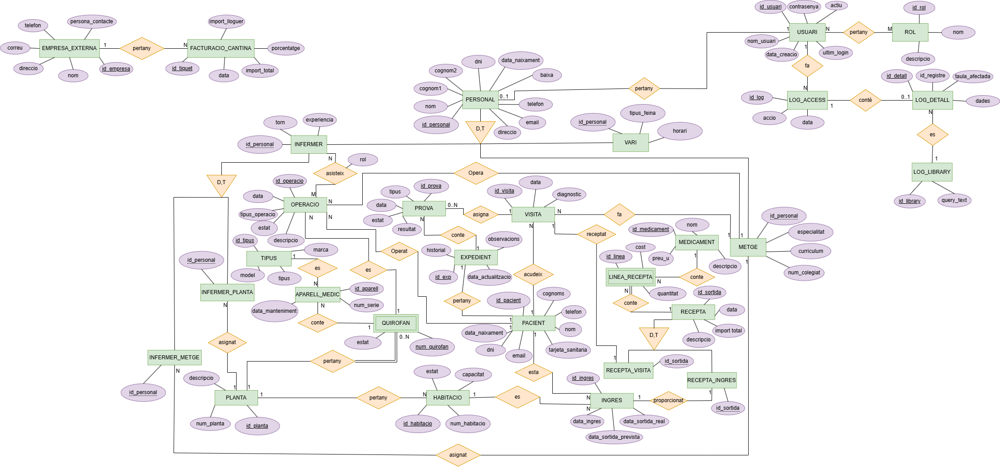

# Disseny de la base de dades
Aquest apartat es tracta de la planificacio i fitxers de creació de la base de dades, incorporant el diagrama de entitat/relacio, el seu model relacional i la creacio de la base de dades i le seves taules.

Per a poder accedir a la creacio de les taules en un .sql esta desde aquí: [fitxer](../Esquema-seguretat/db-schema/taules-schema.sql)

