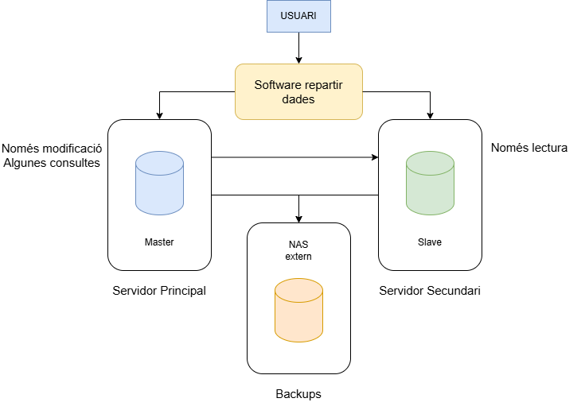

# Esquema d'alta disponibilitat

# Infraestructura de Hardware

Per garantir un sistema fiable, hem dissenyat una infraestructura d'alta disponibilitat amb redundància. Tenim dos servidors de base de dades (nodes). 

**Sistema d’emmagatzematge NAS (HP)**  
- Permet alta disponibilitat i redundància  
- Inclou suport tècnic i reemplaçament de hardware  
- Prioritza la seguretat davant la velocitat

**Sistema operatiu**  
- Linux (entorn estable i segur)  
- PostgreSQL com a SGBD  
- Suport empresarial amb Red Hat (no l'aplicarem al projcte però pensem que seria una bona pràctica)

Aquesta configuració permet evitar punts de fallada, garantir disponibilitat contínua i facilitar la recuperació ràpida davant errors.

Principalment s'ha de parlar de com s'extructura el servidor, més a dir el hardware, es necesitarà un servidor potent per a fer les consultes necesaries de forma rapida, aquesta seria la proposta:

| Component | Opció proposada | Explicació |
| :--- | :--- | :--- |
| CPU | Intel Xeon E-2434 3.4/5GHz | Permet gestionar múltiples consultes a la vegada i càrrega massiva d’usuaris sense perdre rendiment (té gran capacitat de nuclis i escalabilitat) |
| RAM | 32 GB | Postgres utilitza molta memòria per cache (shared_buffers), millora molt el rendiment de consultes |
| Emmagatzematge | SSD NVMe 1TB | Alta velocitat de lectura i escriptura + redundància en cas de fallada de disc |
| Xarxa | 1 Gbps mínim / 10 Gbps recomanat | Necessari per la replicació amb el node secundari i accés d’usuaris |
| Backup | NAS HP extern | Emmagatzematge segur per a còpies de seguretat separades del servidor |

El servidor ha de ser bastant potent perquè és el que gestiona totes les escriptures de la bd, genera els logs del WAL per a la replicació i dona servei a tots els clients.

Fer servir NVMe amb RAID 1 assegura l'alta velocitat i la tolerància a fallades, és a dir que si falla un disc, el sistema continua funcionant, en l'apartat del sistema.

Com a seguretat s'aplicara un RAID 5 dins de cada separació de les dades, per lo que comporta la seva reduncancia, facilitat, cost i disponibilitat de dades.

# Rèplica

Per la seva simplicitat i el proporcionat s'utilitzara el sistema de actiu-passiu, ja que seria per a un pressupost baix, que és just el que busquem. 



## Tipus de replicació escollida:

**Model Actiu-Passiu (Master-Slave)**

Master:
- Node principal
- Permet escriptura i modificacions

Slave:
- Node secundari
- Només lectura
- Rep dades replicades en temps real

Aquesta replicació es fara al núvol, on aquest cas sera el AWS, ja que facilita aquesta feina i ja disponem de les seves funcionalitats.
Per a manterir les dades segures amb el servidor dins del nuvol es fara una conexió vpn site-to-site, on aconseguim que les dades vaguin més segures entre servidors.

## Funcionament

El node rep totes les operacions com Insert, update i delete, després aquestes operacions es registren al **WAL** (que és Write-Ahead Log). El slave replica aquests canvis automàticament i en cas de fallada del Master, el slave passa a ser el nou master.

*WAL: qualsevol transacció que estigui modificant les dades ho va guardant en fitxers de log, si hi han un problema, indiquem la posició inicial per recuperar (LSN), és el punt el qual podrem recuperar, li diem que recupera a partir del LSN (i número d’aquest) (configurar al postgres.conf). Si s’omple es van fent còpies dels fitxers de logs, així no es perd res.*


Així garantir la alta disponibilitat, una recuperació ràpida de les dades i reduïr la seva pèrdua.

## Administració

Configuració del `postgresql.conf` per permetre connexions del node secundari:
```
wal_level = replica
archive_mode = on
archive_command = 'test ! -f /var/lib/postgresql/wal_real/%f && cp %p /var/lib/postgresql/wal_real/%f'
```
Al final del document esta el manual de instal·lació tant del servidor master i configuració del slave per a la seva replicació.

En cas de fallada del node master s'haura de executar de forma manual que el servidor slave es promocioni com a master, fer-ho de forma automatica compondria dificultats i temps per a programar-ho a més de poden haber-hi falses fallades.
[Script de promoció](./Scripts/script-master-fail.sh)

# Backups

Es faran diferents tipus de còpies:

- Backup complet (pg_dump): es realitza una vegada per setmana (els caps de setmana per la nit)
- Backup incremental: es realitza diàriament, basat en arxius WAL (archiving)

RPO: temps màxim de dades que es poden perdre

RTO: temps màxim per restaurar el sistema.

Interessa que sigui els dos triguin el menor temps possible, especialment per a aplicacions on cada minut d'innactivitat pot provocar pèrdues en cas d'incidència.

Els arxius WAL permeten fer recuperació fins a un punt concret (PITR: point in time recovery), aplicant els canvis després d’un backup complet i incremental.

## Backup en calent

El backup en calent permet realitzar còpies de seguretat sense aturar el servei de postgres, és a dir amb la BD en funcionament i accessible pels usuaris. No es pot permetre el downtime.

### Funcionament

- Backup complet inicial que és la base del backup. [script](./Scripts/script-copia-completa.sh)
- Backup incremental generat desde la copia completa fins el moment de fer la copia [script](./Scripts/script-copia-incremental.sh)
- Arxius WAL

Primer es realitza una còpia completa de la bd i a partir d'aquesta totes les modificacions que es fan a la bd es registren als fitxers Wal on es generara l'incremental. Aquests fitxers es van guardant i permeten reconstruir la bd (el seu estat) en qualsevol moment després amb perdues casi nules.

### Configuració necessària

Per habilitar els backups en calent cal confgurar el fitxer en ``postgresql.conf``:

```
wal_level = replica
archive_mode = on
archive_command = 'cp %p /var/lib/postgresql/wal_real/%f'
```

Realització del backup complet amb: 
```
sudo -u postgres pg_basebackup -D /backup/base/<nombackup> -Fp -Xs -T /var/lib/postgresql/data=/backup/base/<nombackup>/extra_data
```

# Restauració

La restauracio no es realitza directament sobre el node de producció, ja que això implicaria aturar el servei i provocar downtime. En un entorn crític com un hospital, la base de dades ha d’estar disponible contínuament.
Per aquest motiu s’utilitza una arquitectura actiu-passiu amb rèplica entre dos nodes.

En cas de fallada del node principal (master), el node secundari (slave) passarà a ser el nou node principal per garantir la continuació del servei. La restauració es realitza sobre el node afectat o sobre un nou servidor, evitant interrompre el funcionament del sistema.

La recuperació de dades es basa en:
- Backup complet
- Backup incremental
- Arxius WAL (Write-Ahead Log)

Aquest sistema permet reconstruir la base de dades fins al punt més recent possible.

## PITR

El PITR permet recuperar la bd fins a un punt concret en el temps.

És útil davant:
- errors humans
- eliminacions accidentals
- actualitzacions incorrectes
- corrupció parcial de dades

El procés de recuperació segueix aquest ordre:

1. Restaurar l’ultim backup complet
2. Aplicar l’últim backup incremental
3. Aplicar els arxius WAL disponibles

Els arxius WAL contenen totes les transaccions realitzades després del backup incremental:
- INSERT
- UPDATE
- DELETE
- també modificacions internes

Postgresql aplica automàticament els WAL durant el procés de recovery per reconstruir l’estat més actual de la bd.

### Restauració completa

Només s’utilitza en casos crítics on no hi ha cap node disponible i això implicaria:
- Aturar PostgreSQL
- Restaurar el backup
- Aplicar WAL

[Script de restauració completa](./Scripts/script-restauracio-completa.sh)

# Estructura del sistema

Especificacions de l'estructura que té el sistema del servidor.

## Particions del disc

| Punt de muntatge | Contingut | Motiu |
| :--- | :--- | :--- |
| / | SO Linux | Separar sistema de dades |
| /var | Logs del sistema | Evitar que omplin tot el disc |
| /var/lib/postgresql | Dades de la BD | Separació crítica de dades |
| /var/log/postgresql | Logs de Postgres | Monitorització i diagnòstic |
| /backup | Còpies de seguretat locals | Restauració ràpida |
| /var/lib/postgresql/15/main | Dades | Estructura interna de PostgreSQL |
| /var/lib/postgresql/wal | dades Wal (pg_wal) | Fitxers de "logs" del sistema |
| /etc/postgresql | Configuració | Arxius de configuració (postgresql.conf, pg_hba.conf) |
| /tmp | Fitxers temporals | Aillar els fitxers temporals per seguretat |
| /home | Usuari | Separar les dades dels usuaris per seguretat |

Separar `/var/lib/postgresql` evita que si hi ha problemes del sistema puguin afectar la base de dades. Els logs es separen per evitar que omplin el disc principal i provoquin errors. Els fitxers WAL en un disc separat milloren el rendiment i permeten una recuperació més eficient en cas de fallada.

## Estructura de fitxers de Postgres

Directori principal /var/lib/postgresql/15/main : conté els fitxers de dades, la configuració interna.

WAL: /var/lib/postgresql/15/main/pg_wal permet guadar totes les transaccions i permet la recuperació en cas de fallada.

Gestió de logs a /var/log/postgresql/ serán errors del servidor, connexions.


## Distribució del sistema

### Dins del servidor
- PostgreSQL
- Dades (/var/lib/postgresql)
- WAL
- Scripts de backup

### Fora del servidor
- Backups (NAS)
- Node secundari (replicació)
- Logs (s'envien cap a fora del servidor)

---

[PDF Manual d'instal·lació i configuració](./Manual-instalacio-configuracio.pdf)